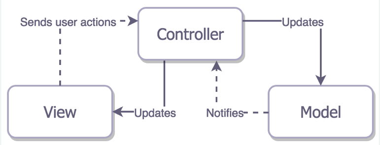
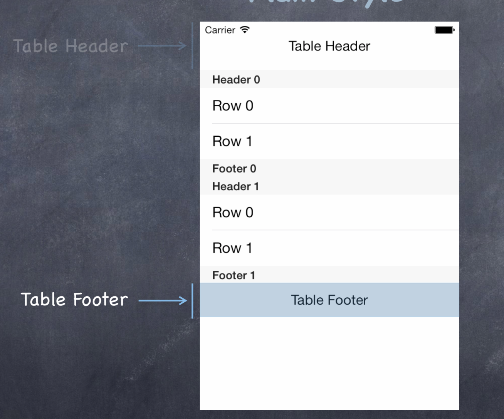

# A Taste Of Developing iOS Application

#### 前言:

> 其实不敢用iOS入门这样的标题，因为感觉自己也才刚入门(hhh)，所以对这次分享的形式我也有做过一些思考，毕竟自己以前并没有过这样来介绍一个大的工程开发领域的经验。
>
> 那么我最后决定是以A Taste Of Developing iOS Application为主题的技术分享，主要是面向对iOS开发、移动端开发有兴趣、无基础的同学。这次分享会让大家对iOS开发有一个大局上的了解，在过程中我会带大家编写一个demo来感受一下iOS开发是怎样的。所以可能会较广地涉及iOS开发中的各个方面，例如Swift、MVC、Views、Frameworks等等，但不会深，体现了A Taste的主题。
>
> 当然也是和有移动端开发经验的同学们一起交流。最后也会给出我在2017年底这时候，对真正想学习iOS开发的同学的一点入门建议。

<!--more-->

# What's in iOS？

**Core OS**

* 最底层，最接近硬件
* iOS是BSD版本的Unix系统

**Core Services**

* 对Core OS层的面向对象封装
* 包括提供手机位置(Core Location)，文件访问(File Access)，网络请求(Networking)等等服务

**Media**

* 图片格式处理
* 音频、视频处理等等

***Cocoa Touch***

* 最顶层，最接近用户，负责iOS的用户界面
* 一整套完整的框架，包括最核心的Foundation和UIKit，其通过对视图层的控件以及其功能的面向对象封装来提供良好的开发环境，是iOS开发唯一的框架，在MacOS开发中称作Cocoa。
* 因前身是被苹果公司收购的NeXT公司用Objective-C语言开发的多媒体系统NeXTSTEP的核心软件框架，因此Cocoa框架中的类都有着NS的前缀。

# 开发环境

**IDE:** **Xcode9** or AppCode

**语言:** Objective-C or **Swift**

* ObjC是对C语言的超集，对其扩充的面向对象编程语言，移动开发火的那几年，ObjC赶上了热潮，就像现在以及可见的未来的人工智能热潮的python。
* 绝大部分公司的主端核心业务都是ObjC，更别说Cocoa框架是Objc编写，所以ObjC无疑是iOS开发必学的语言。
* Swift是苹果公司的亲儿子，于2014年推出，甚至在2015年公开了源码。2016年Swift3.0推出，愈发稳定，越来越多的公司以及新产品都采用Swift开发，Swift毫无疑问是iOS开发的未来(尽管Swift的发明人跑去谷歌了….
* 所以现在入门iOS开发，我非常推荐选择学习Swift，这也是苹果官方所推荐的。之后会详细介绍Swift，相信你一定会喜欢上这门语言，而有了Swift基础再去学习ObjC也是非常快的，毕竟其实本质要学习的是Cocoa开发。

**包管理工具:** **CocoaPods** or Carthage or Swift Package Manager

* 可能Carthage的"风评"越来越好，但它其实是将所有配置交给Xcode，本身只负责下载库，解析库版本依赖。
* 而CocoaPods可以实现cmake的机制，有更多定制的高级功能。

**设计模式:** **MVC**、MVVM

* 苹果官方主推MVC，从ViewController的命名上看，心中就已经有🅱🌲了。
* 目前潮流以及大势是MVVM。

# Swift编程语言

## 概述

* 于2014年WWDC发布，2016年发布Swift3.0后语法开始趋于稳定，最新为Swift4.0。

* Swift3.0与2.0相比改动较大，几乎Cocoa的NS前缀都"去除"了，比如NSURL -> URL，但其实本质是提供去除NS前缀的struct来引用NS类。

* Swift是强类型静态语言，关于强类型、弱类型、动态、静态的定义很多人有自己的理解。弱类型语言对于类型检查不严格，比如会容忍隐式的类型转换，而强类型语言Swift对于类型需要强制定义。动态语言在运行期间才去确定数据类型(Python)，而静态语言Swift会在编译时确定数据类型。

* Swift设计初就有成为universal language的野心，是具有脚本性的编译语言，Swift本质是编译性语言不用说，关于其的脚本性主要是因为类型推断、大量语法糖甚至Playground让人感觉像是脚本语言，而这也正是Swift友好、易上手的体现。

  > Swift is friendly to new programmers. It is the first industrial-quality systems programming language that is **as expressive and enjoyable as a scripting language**. 
  >
  > ​											— The Swift Programming Language

* Swift基于安全性开发，是**type-safe**的编程语言，这也是其是静态语言的原因。它让你清楚地知道代码要处理的值的类型，让你在开发的时候尽早发现并修复错误。类型推断、Optional都是类型安全的重要体现。

* Swift对于函数式编程和流式编程拥有原生的支持，使用->符号来支持函数和闭包，map、flapmap、filter等内置函数等。目前流行的语言对函数式编程的支持都很强，**函数式响应式(Functional Reactive Programming)**的编程思想在前端、移动端已经越来越流行。

## demo所用到的Swift简单语法特性介绍

### Constants and Variables

* 使用关键词**let**来声明常量。
* 使用关键词**var**来声明变量。

```swift
let maximunNumberOfLoginAttempts = 10
var currentLoginAttempt = 0
```

### Type Annotations

* 使用类型注释在声明常量或变量时去确定其类型。

```swift
var welcomeMessage: String
```

* 之前未使用类型注释但未报错，是因为Swift编译器能根据赋予的初始值去推断类型。

```swift
//correct
var welcomeMessage = "Hello Swift"

//wrong
var welcomeMessage
```

* 因为类型推断的存在，在实际代码编写中很少去写类型注释。

### Print & Comments

* Swift使用字符串插入，即先对字符串中插入占位符(常量或变量)，再用其的值去替代。

```swift
var text = "Swift"
print("Hello \(text)")
// Hello Swift
```

* Swift的注释支持嵌套，这个的作用就是你可以快速地注释掉大量代码，即使代码已经包含了多行注释。

### *Optional(可选类型)

* Optional是Swift语言非常非常非常重要的概念，也可以说Optional出现在iOS开发中的任何地方。
* Swift使用optional来表示值可能缺失的情况，optional代表着两种可能性，如果存在值，那么可以**unwrap the optional**去获取值，或者不存在值，即为nil。

#### 产生optional

* 通过赋予可选变量特殊值nil来表示其没有值。


* 问号暗示包含的值是可选类型，Int?即其可能包含Int值，也可能没有值。

  ```swift
  // 例如将String转为Int可能失败
  // convertedNumber被推测为"Int?"类型，而不是Int
  let possibleNumber = "123"
  let convertedNumber = Int(possibleNumber)

  // 赋值为nil表示没有值
  // 申明一个可选常量或变量但未赋值，会自动设置为nil
  var answer: String?
  ```

#### unwrap the optional

* 使用感叹号！去强制解析

```swift
print(convertedNumber)
// Optional(123)
print(convertedNumber!)
// 123
```

* 使用可选绑定(optinal binding)来判断可选类型是否包含值

```swift
if let actualNumber = Int(possibleNumber) {
  print("it has an integer value of \(actualNumber)")
} else {
  print("it could not be converted to an integer")
}
// it has an integer value of 123
```

* Optional本质上就是个枚举

```swift
//Optional作为泛型枚举的定义
enum Optional<T> {
  case none
  case some(T)
}

let x: String？ = nil
... is ...
let x = Optional<String>.none

let x: String? = "hello"
... is ...
let x = Optional<String>.some("hello")

let y = x!
... is ...
switch x {
  case some(let value): y = value
  case none: //raise an exception
}

let x: String? = ...
if let y = x {
  // do something with y
}
... is ...
switch x {
  case .some(let y):
 	// do something with y
  case .none:
 	break
}
```

* Optional Chaining

* 空合运算符(Nil Coalescing Operator)

  ```swift
  // 本质是三目运算符
  // a != nil ? a! : b

  let defaultColorName = "red"
  var userDefinedColorName: String?
  var colorNameToUse = userDefinedColorName ?? defaultColorName
  // 输出red
  ```

### 数组

```swift
/// 创建空数组
var someInts = [Int]() 
someInts.append(3)

var shoppingList: [String] = ["Eggs","Milk"]
//遍历数组
for item in shoppingList {
  print(item)
}
// Eggs
// Milk
```

### 字典

```swift
var parameters: [String: String] = ["cardNumber" : "71115414"]
```

### Enum + switch

* Swift中可以定义枚举来关联任意类型的关联值


* switch的值绑定(value bindings)，即允许将匹配的值绑定到一个临时的常量或变量，并且在case分支体内使用。

```swift
enum Movement {
    case Left
    case Right
    case Top
    case Bottom
}

let aMovement = Movement.Left

// .Left也是类型推断的体现
switch aMovement {
case .Left:
    print("left")
default:
    print("Unknown")
}

// 关联值与值绑定
enum BodyData {
    case height(Int)
    case sex(String)
}

// 关联值180
let Bob_height = BodyData.height(180)

// 值绑定
switch Bob_height {
case .height(let height):
    print(height)
case .sex(let sex):
    print(sex)
}
```

### 函数

* 返回箭头->表明所返回的类型

```swift
func greet(person: String) -> String {
    let greeting = "Hello, " + person + "!"
    return greeting
}
```

* swift的函数中，每个函数参数都有一个参数标签(argument label)以及一个参数名称(parameter name)，参数标签在调用函数时使用，参数名称在函数的实现中使用。

  ```swift
  // 默认情况下，函数参数使用参数名称来作为它们的参数标签
  func someFunction(firstParameterName: Int, secondParameterName: Int) {
  // 在函数体内，firstParameterName 和 secondParameterName 代表参数中的第一个和第二个参数值
  }
  someFunction(firstParameterName: 1, secondParameterName: 2)

  // 指定参数标签，以空格分隔
  func someFunction(argumentLabel parameterName: Int) { 
    // 在函数体内，parameterName 代表参数值
  }

  // 参数标签的命名可以带来良好的代码阅读体验
  func request(for path: String) -> URLRequest { }
  let request = request(for: "www.google.com")

  // 使用_忽略参数标签
  func someFunction(_ firstParameterName: Int, secondParameterName: Int) {
  // 在函数体内，firstParameterName 和 secondParameterName 代表参数中的第一个和第二个参数值
  }
  someFunction(1, secondParameterName: 2)
  ```

* 函数类型、函数作为参数、嵌套函数等等

### *闭包(Closure)

* 闭包是自包含的函数代码块，可以在代码中被传递和使用。是Objc中blocks的演变，也类似其他语言中的lambda表达式(匿名函数)。

* 闭包可以捕获(capturing)和存储其在上下文中的任意常量和变量的引用，Swift会自己管理在过程中涉及到的所有内存操作。

* 函数中的全局函数和嵌套函数实际上就是特殊的闭包。

* 闭包表达式

  ```swift
  { (parameters) -> (return type) in
    statements
  }
  ```

* Swift语法设计是能省略则省略。

  ```swift
  let numbers = [1,2,3]

  // in关键字分隔闭包的参数与函数体
  var doubleNumbers = numbers.map({
      (number: Int) -> Int in
      return number * 2
  })
  print(doubleNumbers)
  // [2,4,6]

  // 参数类型和返回类型可以自动推导出，所以可以省略
  var doubleNumbers = numbers.map({ number in
      return number * 2
  })

  // 闭包知道需要返回值(根据map)，所以可以省略return
  var doubleNumbers = numbers.map({ number in number * 2 })

  // 尾随闭包: 闭包表达式作为作为最后一个参数传递给函数时，可以省略参数标签(这里本来就没有)，省略()
  var doubleNumbers = numbers.map { number in number * 2 }

  // 可以用$0表示第一个参数，$2表示第二个参数
  var doubleNumbers = numbers.map { $0 * 2 }
  ```

### 类与结构体(class && struct)

* 相信大家都有OOP的经验，主要强调类与结构体的差别。

* 结构体是值类型，值类型被赋予给一个变量、常量或者被传递给一个函数时，其值会被拷贝。

* 类是引用类型，引用类型在上述操作时，其值不会被拷贝。

* demo中用到了属性观察器(Property Observers)

  ```swift
  // 属性观察期监控和响应属性值的变化，didSet会在新的值被设置之后立即调用
  var repoInfo: RepositoryInfo? {
          didSet {
              updateUI()
          }
      }
  ```

### *协议、扩展、代理(protocol、extension、delegate)

#### 协议(protocol)

* 类似于java的interface？ 
* 定义了一个蓝图，规定了用来实现某一特定任务或者功能的方法、属性。
* 类、结构体、枚举都可以遵循协议。

```swift
// protocol关键字
protocol descriptionProtocol {
  func description() -> String
}

class Person: descriptionProtocol {
  func description() -> String {
    return ""
  }
}
```

#### 代理(delegate)

* 代理模式，即将一个对象的一部分功能委托给其他类型的实例。

* 具体过程: 定义协议来封装那些需要被委托的功能，这样遵循协议的类型就能提供这些功能。

* 减少了代码复杂度，在iOS中大量使用。

  ```swift
  // 定义协议来委托需要实现的功能
  protocol LogManagerDelegate {
    func writeLog()
  }

  // 用户登录类，想将保存日志记录的功能委托出去
  class UserController:  {
    var delegate: LogManagerDelegate?
    // 查看是否有代理，然后调用它
    func login() {
      delegate?.writeLog()
    }
  }

  // 日志管理类，遵循了LogManagerDelegate的协议
  class MysqlLogManager: LogManagerDelegate {
    func writeLog() {
      print("将日志保存到mysql数据库中")
    }
  }

  let userController = UserController()
  userController.login()
  // nothing

  let mysqlLogManager = MysqlLogManager()
  userController.delegate = mysqlLogManager //声明delegate
  userController.login()
  // 将日志保存到mysql数据库中
  ```

#### 扩展(extension)

- 可以使已有类型遵循并符合协议。

```swift
// demo中代码，使controller实现uitextfield的协议，作为其代理
extension ViewController: UITextFieldDelegate {
    func textFieldShouldReturn(_ textField: UITextField) -> Bool {
        searchForGithub(repositoryName: textField.text!)
        textField.resignFirstResponder()
        return true
    }
}
```


# 开发模式

* 按UI设计划分
  1. xib/Storyboard党
  2. 纯代码党(手动AutoLayout党)，使用Masonry、SnapKit第三方库
* 按设计模式划分
  1. MVC
  2. MVVM

## Storyboard

* 是多个xib(界面布局文件)的集合。


* Apple一直在强力推广Storyboard + MVC的开发模式，Storyboard拥有上手容易、直观、页面跳转逻辑可视化等优点，Storyboard更多是降低了iOS开发的技术入门门槛。
* 但不太适合多人开发(虽可以做拆分)，且当页面逻辑复杂时，做变更和复用是非常麻烦的事。
* 纯代码布局，容易复用，且容易批量调整。
* **用Storyboard大概是一时爽吧….即短期开发出一个demo使用storyboard很快**

## AutoLayout

* iOS开发中描述性的布局方式，同时也是处理适配手机屏幕的主要方式之一(搭配SizeClass)
* 掌握AutoLayout更多是经验。
* 核心是**约束**和**参照**，在iOS中要显示一个控件，需要其**位置**和**尺寸**。
* 约束就是对控件的尺寸大小或者位置进行约束，参照是以另一个控件的位置进行约束(是的，本质上都是约束hhh)

##### 小技巧

* 可以使用一个空的UIView作为Container作为参照，固定宽高。
* 要善于使用centerX和centerY作为参照。

## MVC

* 苹果的MVC和传统的MVC有些出入。

* 一种面向对象的设计模式，将程序划分为三个部分。

* Model(模型)

  *  数据层
  *  what the app is，but not how it is displayed
  *  kinda like algorithms and data structure
  *  与UI无关

* Controller(控制器)

  * 决定model如何展示到屏幕上(how it displays)
  * 与用户交互
  * Model与View之间的**胶水层**

* View(视图)

  - 视图层，对于iOS来说以**UI开头的类**基本都属于这层
  - 从属于控制器，控制器复用View来实现其展示到屏幕上的功能。

* 关系

  * View与Model之间相互独立，只能通过Controller来相互联系

  

**在iOS实际开发中，Controller很难和View做到相互独立，经常耦合在一起，即使你可以将一些业务逻辑和数据转换的工作交给Model，但是你无法将负担分给View，因为View本质还是重用的视图，以及将用户的操作行为交给Controller来处理。于是Controller成为了所有东西的delegate和dataSource，还要负责网络请求逻辑……..**

**所以Massive Controller是iOS开发者不可避免的需要面对的问题，MVVM的设计模式能很有效地解决这一问题**

**这次demo还是以苹果所推广的开发模式来编写，即Storyboard + MVC，个人也认为刚接触iOS开发时也应该先熟悉这种开发模式，之后再去上手纯代码布局，MVVM这些操作。**

# CocoaPods构建工程

#### Single View App的project的初始目录

- AppDelegate.swift 应用程序的代理
- ViewController.swift
- Main.storyboard
- Assets.xcasstes 图片资源等
- LaunchScreen.storyboard
- info.plist 配置设置文件

#### 构建CocoaPods工程

* touch podfile

  ```json
  source 'https://github.com/CocoaPods/Specs.git'
  platform:ios,'9.0'
  use_frameworks!
  target 'demo-finish' do
  	pod 'Alamofire','~> 4.4.0'
  	pod 'SwiftyJSON'
  	pod 'SDWebImage', '~> 4.0'
  end
  ```

* pod install


* 打开demo.xcworkspace

# TablebView

* TableView几乎是iOS开发中最重要的UIView，其继承了UIScollView

* 分为**Dynamic**和**Static**

  

* tableView是由section组成的，每一个section可以拥有一个header和一个footer，和多行rows。

* 每一个row的原型是cell，即tableview以cell为模板，通过复用来构造整个tableview

  

## 关联代码与TableView

* TableView提供两个协议，dataSource和delegate
  * delegate用来控制视图如何展示
  * datasource提供cell中的数据

## delegate核心的三个函数

* 共多少个sections

  ```swift
  func numberOfSections(in tableView: UITableView) -> Int {}
  ```

* 每个section里有多少个rows

  ```swift
  func tableView(_ tableView: UITableView, numberOfRowsInSection section: Int) -> Int {}
  ```

* 定制每个row (indexPath是包含section和row的容器)

  ```swift
  func tableView(_ tableView: UITableView, cellForRowAt indexPath: IndexPath) -> UITableViewCell {
          let cell = tableView.dequeueReusableCell(withIdentifier: "repoinfo", for: indexPath) as! RepoTableViewCell
          cell.repoInfo = repos[indexPath.section][indexPath.row]
          return cell
  }
  ```

**通常我们使用Array of Arrays来实现model的数据结构，这是概念性的东西，即一维对应着section,二维对应着row，这样通过data\[section][row]即获取了每一个cell所对应的数据。**

```swift
var repos: [[RepositoryInfo]] = []
```

# 总结

* 今天的分享涉及了iOS开发很多方面，但都比较浅显，有没有理解到的地方没关系，最主要的目的就是让大家对iOS开发能有个初步的了解与体会。
* 现在前端越来越有将移动端"并入"的趋势，事实的确如此，从之前的Web APP，到最近的React Native，包括MVVM，而且React的思想也是从前端传过来的。但是原生APP开发方式始终有它的优势所在，尤其是iOS开发终归要听苹果爸爸的意见。React Native最初开发目的其实是给前端的js玩家能够快速迭代开发移动端，而并不是想来"勾引"原生开发者(虽然它做到了….)
* 移动开发现在的确不如前些年火热，甚至有给人"没落"的印象，门槛提高的确是不争的事实，但任何领域都不缺优秀的开发者。被淘汰，"被饱和"的永远是初级的开发者。
* 我觉得扩宽技能树是一方面，但能越早地选择专攻的方向越好，坠好是能找到自己感兴趣的方向。我自己当时学习iOS除了果粉的原因外，主要是自己平日接触时间最长的东西就是手机，觉得从口袋里掏出手机，给别人展示自己写的APP很cool。
* 找不到兴趣所在，就去搞机器学习吧  : )

## iOS入门推荐资源

* Developing iOS11 Apps with Swift(Standford CS193P)   itunes(posts)应该有英文字幕的

* The Swift Language Guide (Apple官方Swift指导书)

* https://github.com/vsouza/awesome-ios (iOS awesome系列)

* https://github.com/matteocrippa/awesome-swift (swift awesome系列)

* http://swifter.tips (王巍大神给swifter的100个tips)

* https://www.boxueio.com (国产良心iOS开发视频教学资源，收费)

  ​